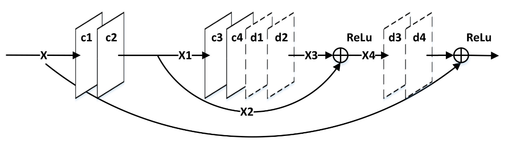
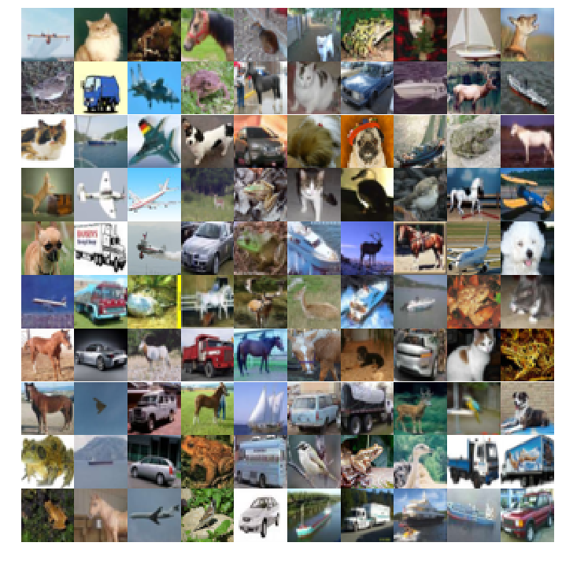
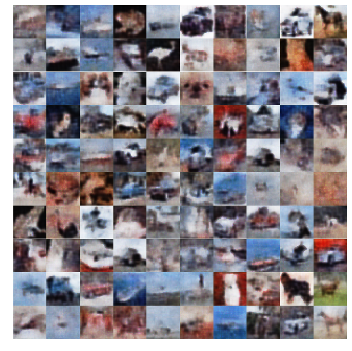
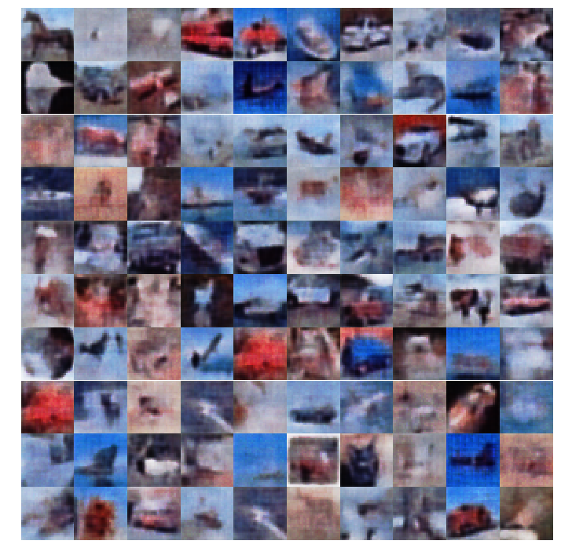
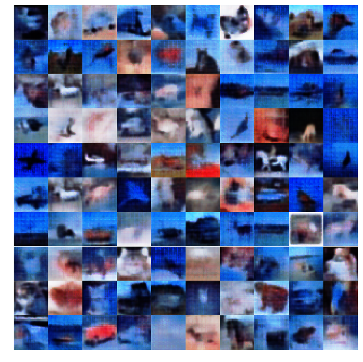

# Convolutional Autoencoders with Symmetric Skip Connections
Fully convolutional networks for autoencoders with very deep connections are succeptible two things:
* Vanishing Gradients
* Significant amount of corruption of image details

To over come this paper, [Image Restoration Using Convolutional Auto-encoders with Symmetric Skip Connections](./https://arxiv.org/pdf/1606.08921.pdf) 
used skip connections between the mirrored convolutional and deconvolutional layers. Relying on this we can overcome the above mentioned issues.

|  |
|:-------------------------------------------------:|
| *An example of a building block in the proposed framework.* |

## Dataset
The AE is trained on [Cifar-10](https://www.cs.toronto.edu/~kriz/cifar.html) dataset for about 100 epochs.

| |
|:----------------------------------:|
| *CIFAR-10 Images* |

## Output 

To see the results of your training from the [SSC_demo notebook](./SSC_Demo.ipynb) - Start a new terminal and execute command:
```
tensorboard --logdir=./ae_ssc
```

and then go to ``<your-public-ip-adress>:6006`` (if training on an instance) or to ``<localhost>:6006`` (if training on local system).


* Noising Ratio - 0.4: 40% noisy image + 60% image

|  |
|:------------------------------------------:|
| *Outputs Noising Ratio 0.4* |

* Noising Ratio - 0.2: 20% noisy image + 80% image

|  |
|:------------------------------------------:|
| *Outputs Noising Ratio 0.2* |


* No Noise

|  |
|:------------------------------------------:|
| *Outputs no Noise* |

## Issue Encountered
The AE is strangely getting stuck with blue tint in case of no noise input.