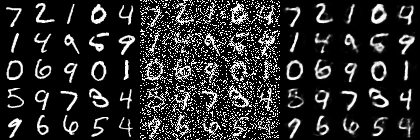
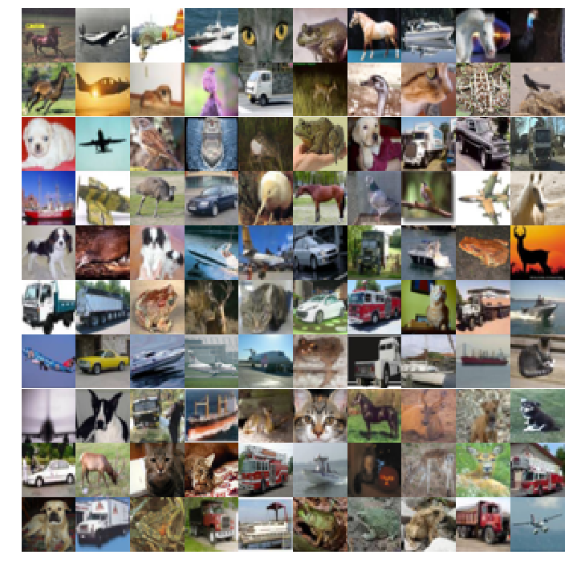
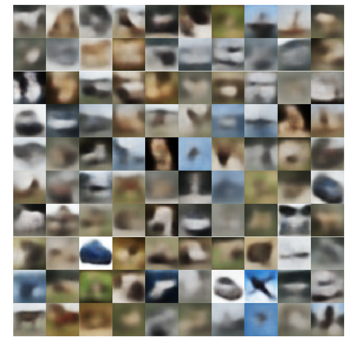
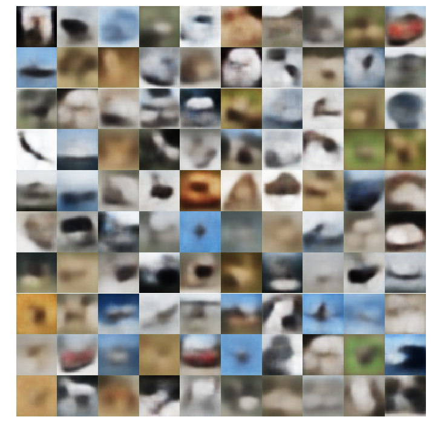
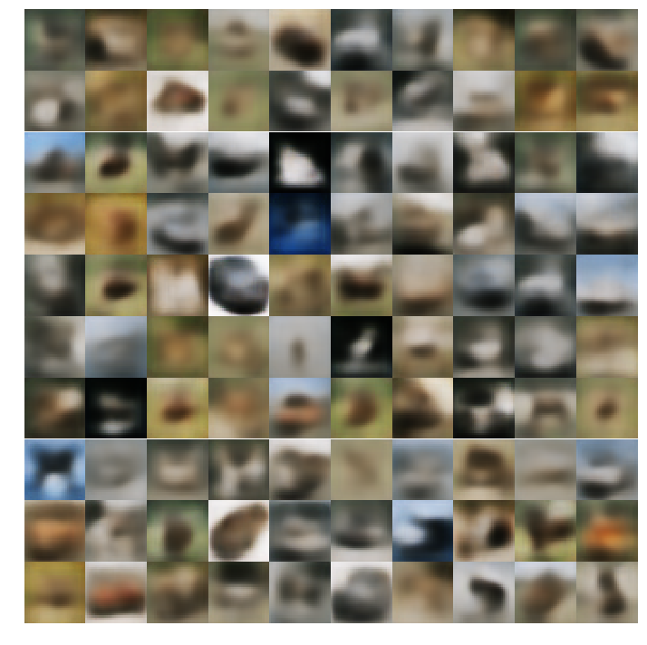
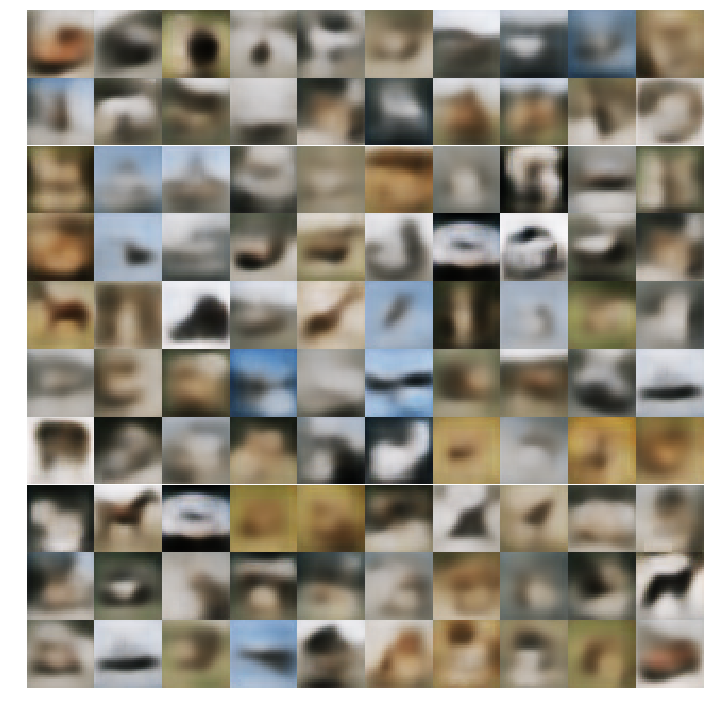
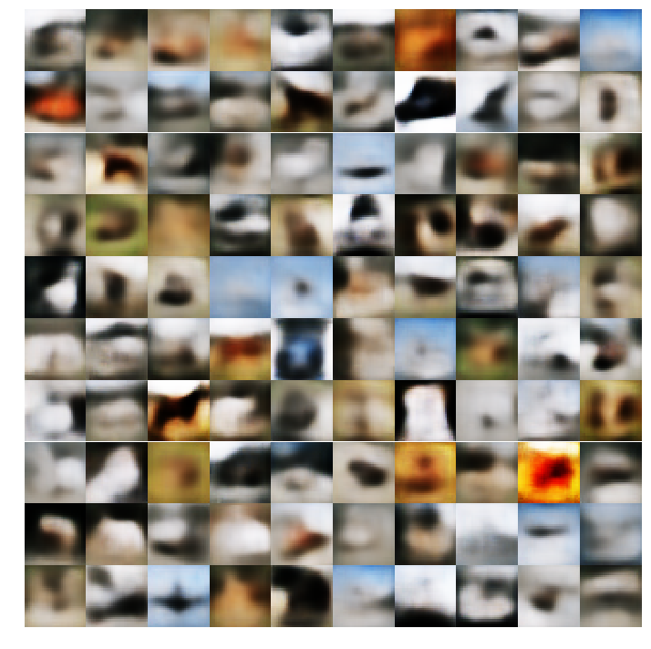

# Denoising Autoencoders
Autoencoders can be used to remove noise (denoise) from an image. But how? Train the encoder part to encode a noisy image and the decoder part to reconstruct an image that is more similar to the image without noise.

|  |
|:------------------------------------------:|
| * Denoising Autoencoder Results* |

## Dataset
The DAE is trained on [Cifar-10](https://www.cs.toronto.edu/~kriz/cifar.html) dataset for about 30 epochs.

| |
|:----------------------------------:|
| *CIFAR-10 Images* |

## Output
The VAE generated vague images on start but got better with time. 

* To see the results of your training from the [DAE_demo notebook](./DAE_Demo.ipynb) - Start a new terminal and execute command:
```
tensorboard --logdir=./dae
```

* To see the results of your training from the [DAE_VAE_DEMO notebook](./DAE_VAE_DEMO.ipynb) - Start a new terminal and execute command:
```
tensorboard --logdir=./dae_vae
```

and then go to ``<your-public-ip-adress>:6000`` (if training on an instance) or to ``<localhost>:6000`` (if training on local system).


### DAE without Variational Space
* Noising Ratio - 0.4: 40% noisy image + 60% image

|  |
|:------------------------------------------:|
| *DAE outputs Noising Ratio 0.4* |

* Noising Ratio - 0.2: 20% noisy image + 80% image

|  |
|:------------------------------------------:|
| *DAE outputs Noising Ratio 0.2* |


* No Noise

|  |
|:------------------------------------------:|
| *DAE outputs no Noise* |

### Variational DAE
* Noising Ratio - 0.4: 40% noisy image + 60% image

|  |
|:------------------------------------------:|
| *Variational DAE outputs Noising Ratio 0.4* |

* Noising Ratio - 0.2: 20% noisy image + 80% image

|  |
|:------------------------------------------:|
| *Variational DAE outputs Noising Ratio 0.2* |


* No Noise

|  |
|:------------------------------------------:|
| *Variational DAE outputs no Noise* |
