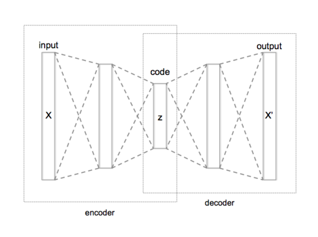

# Autoencoders
Autoencoders come under the category of Unsupervised Deep Learning. This means that there are no labels for the input. They usually are generative models, i.e., they can create new images.

|  |
|:----------------------:|
| *Schematic structure of an autoencoder with 3 fully-connected hidden layers.* |
| *Source: [Wikipedia](https://en.wikipedia.org/wiki/Autoencoder)* |

This repository contains my implementations for autoencoders. Currently there are 3 autoencoders:

* [Vanilla Autoencoder](./Simple-Autoecnoders)
* [Variational Autoecnoder](./VAE)
* [Denosing Autoecnoder](./Denoising-Autoenocders)
* [Convolutional Autoencoders with Symmetric Skip Connections](./AE-With-SSCs)

## Dependencies
* TensorFlow
* Numpy
* Pandas
* Matplotlib
* OpenCV
