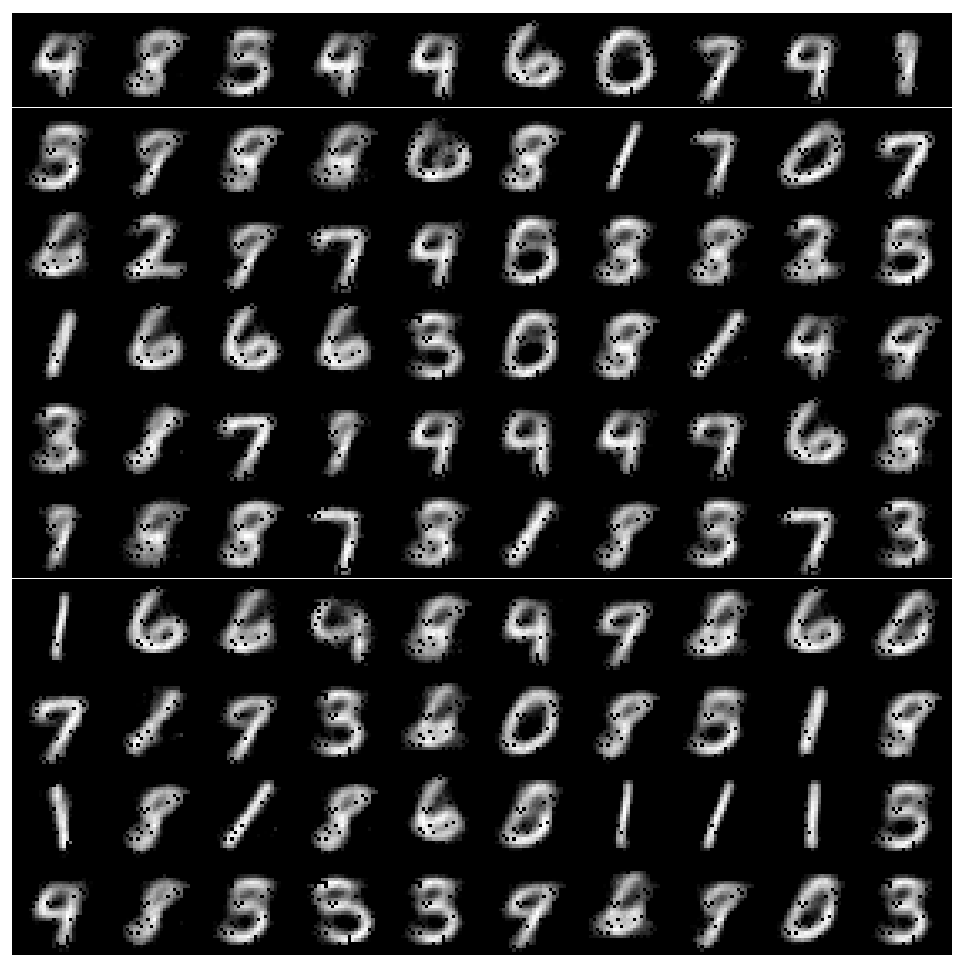

# Autoencoder
An autoencoder is a combination of two sub-netowrks - encoder and decoder. As the name suggests and encoder encodes the input information and the decoder decodes the encodings into the information that was feeded into the encoder.

## Dataset
Dataset used is MNIST

| |
|:-----------------------------------:|
| *MNIST Dataset* |

## Output

| |
|:----------------------------------------------:|
| *Decoder Output* |
