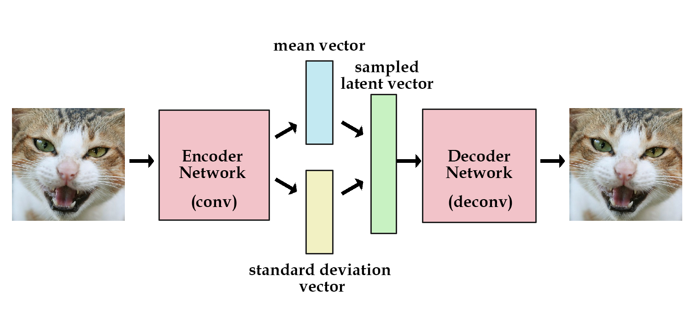
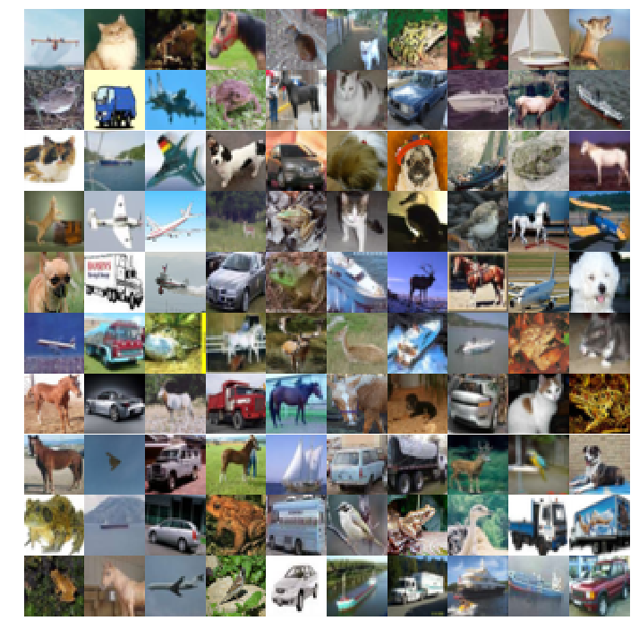
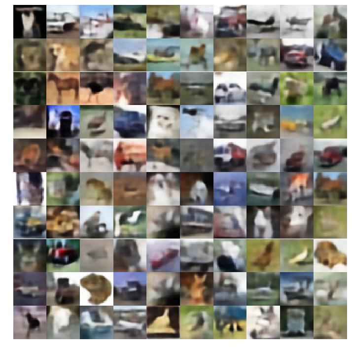

# Variational Autoencoders
Simple autoencoders can be considered as a data structures that memorize an image and regenerate it. But we want to generate new images not a data structure to memorize the image. To do it we add stochastic nature to our model by introducing a latent vector that is generated using the outputs of the encoder network. Where outputs of the encoder network represent the mean and standard deviation of the latent gaussian vector

|  |
|:------------------------:|
| *Variational Autoencoder* |
| *Source: [Variational Autoencoders Explained](http://kvfrans.com/variational-autoencoders-explained/)* |

## Dataset
The VAE is trained on [Cifar-10](https://www.cs.toronto.edu/~kriz/cifar.html) dataset 
for about 30 epochs.

| |
|:----------------------------------:|
| *CIFAR-10 Images* |

## Output
The VAE generated vague images on start but got better with time. To see the results of your training from the VAE-demo notebook - Start a new terminal and execute command:
```
tensorboard --logdir=./vae_400
```

and then go to ``<your-public-ip-adress>:6000`` (if training on an instance) or to ``<localhost>:6000`` (if training on local system).


### Final Output
|  |
|:------------------------------------------:|
| *VAE outputs* |
